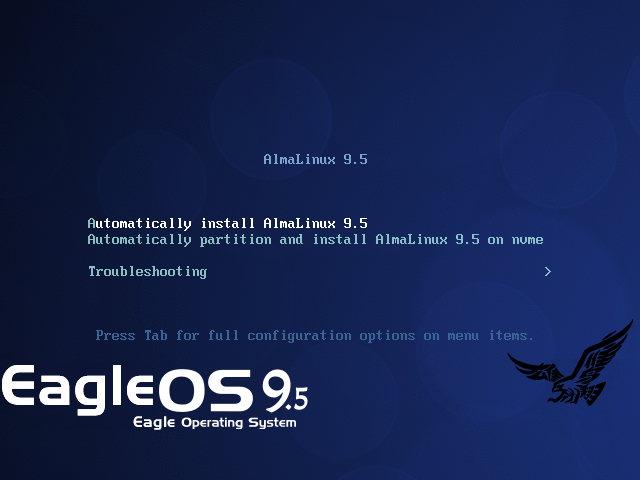
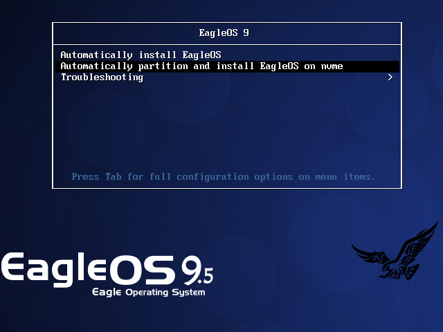

EagleOS 9.5 Documentation [中文](README_CN.md)

# I. System Introduction

EagleOS 9.5 is deeply customized and optimized based on AlmaLinux 9.5.

EagleOS 9.5 according to AlmaLinux 9.5 official AlmaLinux-9.5-x86_64-dvd.iso streamlining, the whole process of fully automated and unattended installation, support for more than 2TB disk automatic partitioning, integrated installation of 1151 software packages, including commonly used tools and libraries and other dependencies, iso file size from the official 10.6G The iso file size from the official 10.6G to less than 2.6G, so that the installation efficiency more efficient.

EagleOS 9.5 automatically performs the following system optimizations during the installation process:

(1) Disable selinux

(2) Disable NetworkManager and use traditional network instead.

(3) Optimize the disabling of some services and kernel parameters.

(4) integrated epel, elrepo source, and change the use of domestic sources

(5) integrated installation of unrar, p7zip and other commonly used packages

After the installation is completed, ssh port: 49156, default ip: 192.168.0.205, system super user name: root, password: www.ip40.com

# II. System installation instructions   

## EagleOS system iso file download

Please go to sky cloud disk to download eagleos9.5.iso at high speed:

https://eagleos.sourceforge.io

https://cloud.189.cn/t/JjiqyeqQ7Fri

(Access Code: 2zkf)

## EagleOS system installation method

- CD-ROM installation

Please burn eagleos9.5.iso to CD-ROM and set the target server to boot from CD-ROM drive for installation.

- U disk installation

Support 2 ways to install:

(1) Burn to a USB flash drive as a cdrom, and set the target server to boot from the USB flash drive for installation.

(2) Use Ventoy or other tools to create a USB flash drive bootable boot, copy eagleos9.5.iso to the USB flash drive, set the target server to boot from the USB flash drive for installation, and directly select eagleos9.5.iso for bootable installation.

- PXE Network Installation (Linux)

 Install syslinux on Linux, copy /usr/share/syslinux/pxelinux.0 to tftp root directory, the rest is omitted.

- PXE network installation (Windows)

(1) the CD-ROM directory / images / pxeboot copied to any directory of the windows system, directly double-click the directory under the tftpd64.exe, that is, automatically start the pxe server (including dhcp, tftp and other services), you can modify the relevant configurations, directly effective.

(2) in the windows system using nginx, apache httpd or install windows system comes with the iis web role to create web services, the following iis as an example of the relevant configuration:

(3) in the iis site web root directory such as D:\web\pxe under the establishment of such as eagleos9.5 subdirectory, eagleos9.5.iso extracted to this eagleos9.5 subdirectory, modify D:\web\pxe\eagleos9.5\images\pxeboot in the two eagleos9 *. cfg file and D:\web\pxe\eagleos9.5\images\pxeboot. cfg file and 192.168.246.1 in D:\web\pxe\eagleos9.5\images\pxeboot\pxelinux.cfg\default as your web server IP.

(4) Save the following code as web.config in the web root directory such as D:\web\pxe to ensure that the installation files can be downloaded properly during the installation process.

(5) Set the target server to start the installation from the network, you can start to install EagleOS 9.5 from PXE, of course, the target server and your web server must be connected to the network.

---------------------------Start of web.config-------------------- 
```xml
<?xml version="1.0" encoding="UTF-8"?>
<configuration>
    <system.webServer>
        <directoryBrowse enabled="true" ></directoryBrowse>
        <staticContent>
            <mimeMap fileExtension=".cfg" mimeType="application/octet-stream" ></mimeMap>
            <mimeMap fileExtension=".img" mimeType="application/octet-stream" ></mimeMap>
            <mimeMap fileExtension=".bz2" mimeType="application/octet-stream" ></mimeMap>
        </staticContent>
        <security>
            <requestFiltering allowDoubleEscaping="true"></requestFiltering>      
        </security>
    </system.webServer>
</configuration>
```  
---------------------------End of web.config---------------------- 

## EagleOS system installation steps

(1) Please make sure that the target server has been configured raid and other disk configurations, the subsequent installation process will clear the hard disk data and automated partitioning, please make sure that the target server on the target disk, such as important data has been backed up to other servers!

(2) The installation process will automatically configure the network card with a connection to the network (as long as the physical connection can be), so it is recommended to connect the network cable to the first network card to operate, especially in the case of PXE installation, otherwise you will have to manually edit the configuration of the network after installation.

(3) After successfully booting the target server from the CD-ROM or PXE network, you will see the following system installation interface (when entering this interface, please press the keyboard arrow keys up and down quickly and randomly, to avoid the short 6-second delay in the installation interface and automatically start the system installation).

The boot screen for CD-ROM installation:



The boot screen for the PXE network installation method:



Installation startup interface installation options:

The first option is “Automatically install EagleOS”, which requires you to manually partition your hard disk during the installation process, and specify the bootable hard disk in the interface after the formatting is completed, after which the installation is automated and unattended.

The second item is “Automatically partition and install EagleOS on nvme”, to automate partitioning and system installation on /dev/nvme0n1.

(4) The installation interface stays at the first item above by default. You can select the corresponding installation options and press Enter to start the installation. Depending on the hardware configuration, the installation process will take about 15-30 minutes.

(5) After the installation is completed, you will automatically enter the system (PXE mode may require modification of cmos boot depending on the hardware). In the login screen, enter username: root, password: www.ip40.com to log in to the system via the console.

(6) Usually, your network segment configuration is different from the default IP segment configured by eagleos9.5.iso, so you need to modify the network IP and other information in the console after installation:

Modify the network card configuration file /etc/sysconfig/network-scripts/ifcfg-ens160 via vim command, modify the relevant information therein and save and exit, then execute the command: `systemctl restart network` to restart the network service.

You can now log in to the server remotely from your local computer using SecureCRT or other remote login software!

Thank you for your use!

Feel free to give feedback to Eagle with any suggestions and comments: www@xmyy.com


By Eagle

xmyy.com

2025.03.09
