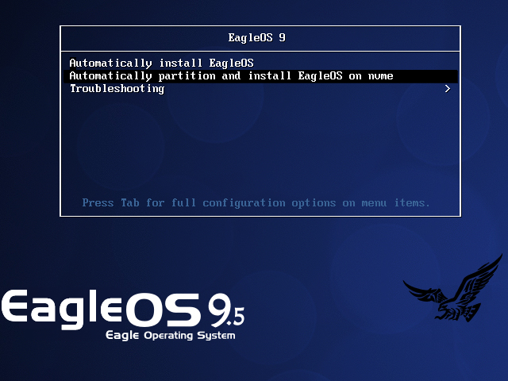

EagleOS 9.5 说明文档 [English](README.md)

# 一、系统简介

EagleOS 9.5基于AlmaLinux 9.5进行深度定制优化。

EagleOS 9.5根据AlmaLinux 9.5官方AlmaLinux-9.5-x86_64-dvd.iso进行精简，全程完全自动化无人值守安装，支持大于2TB磁盘自动分区，集成安装1140个软件包，包含了常用的工具及依赖库等，使装机效率更高效。

EagleOS 9.5安装过程中自动进行了如下几项系统优化：

（1）禁用selinux

（2）禁用NetworkManager，改用传统network

（3）一些服务的禁用、内核参数等优化

（4）集成epel、elrepo源，并更改使用国内源

（5）集成安装unrar、p7zip等常用软件包

安装完成后，ssh端口：49156，默认ip：192.168.0.205，系统超级用户名：root，密码：www.ip40.com

# 二、系统安装说明   

## EagleOS系统iso文件下载

请到天翼云盘高速下载eagleos9.5.iso：

https://cloud.189.cn/t/q6F3Arj6Vf2i

（访问码：ky3u）

## EagleOS系统安装方式

- 光盘安装

请将eagleos9.5.iso刻录成光盘，目标服务器设置从光驱启动进行安装。

- U盘安装

支持2种方式安装：

（1）以cdrom方式量产烧录到U盘，目标服务器设置从U盘启动进行安装。

（2）使用Ventoy等工具制作U盘启动引导，拷贝eagleos9.5.iso到U盘，目标服务器设置从U盘启动进行安装，直接选择eagleos9.5.iso进行引导安装。

- PXE网络安装（Linux）

 在Linux上安装syslinux，拷贝/usr/share/syslinux/pxelinux.0到tftp根目录下，其余略。

- PXE网络安装（Windows）

（1）将本光盘目录/images/pxeboot拷贝到windows系统任意目录下，直接双击本目录下的tftpd64.exe，即自动启动pxe服务器（含dhcp,tftp等服务），可修改相关配置，直接生效。

（2）在windows系统下使用nginx、apache httpd或安装windows系统自带iis中的web角色创建web服务，下面以iis为例详述相关配置：

（3）在iis的站点web根目录如D:\web\pxe下建立如eagleos9.5子目录，将eagleos9.5.iso解压到此eagleos9.5子目录下，修改D:\web\pxe\eagleos9.5\images\pxeboot中2个eagleos9*.cfg文件及D:\web\pxe\eagleos9.5\images\pxeboot\pxelinux.cfg\default中的192.168.246.1为您的web服务器IP。

（4）将如下代码存为web.config，保存于web根目录如D:\web\pxe下，以确保安装过程中能正常下载安装文件。

（5）目标服务器设置从网络启动进行安装，即可开始从PXE安装EagleOS 9.5，当然目标服务器与您的web服务器必须网络是相通的。

---------------------------Start of web.config-------------------- 
```xml
<?xml version="1.0" encoding="UTF-8"?>
<configuration>
    <system.webServer>
        <directoryBrowse enabled="true" ></directoryBrowse>
        <staticContent>
            <mimeMap fileExtension=".cfg" mimeType="application/octet-stream" ></mimeMap>
            <mimeMap fileExtension=".img" mimeType="application/octet-stream" ></mimeMap>
            <mimeMap fileExtension=".bz2" mimeType="application/octet-stream" ></mimeMap>
        </staticContent>
        <security>
            <requestFiltering allowDoubleEscaping="true"></requestFiltering>      
        </security>
    </system.webServer>
</configuration>
```  
---------------------------End of web.config---------------------- 

## EagleOS系统安装步骤

（1）请先确定目标服务器已经配置好raid等磁盘配置，后续安装过程将清空硬盘数据并进行自动化分区，请确定目标服务器目标磁盘上如有重要数据已经备份到其他服务器!!!

（2）安装过程将自动配置有连接网络（只要物理联通即可）的网卡，所以建议将网线接到第一网卡进行操作，特别是在PXE安装情况下，否则安装后您得手工编辑配置网络。

（3）成功从光盘或pxe网络引导启动目标服务器后，您将看到如下的系统安装界面 (进入此界面时，请快速随意按下键盘方向键上下键，避免安装界面短暂的6秒延时超过而自动开始系统安装) :

光盘安装方式的引导界面：


PXE网络安装方式的引导界面：



安装启动界面安装选项说明：

①第一项是“Automatically install EagleOS”，安装过程中只需要您手工进行硬盘分区，格式化完成后的界面中指定好引导启动的硬盘，之后都是自动化无人值守安装操作。

②第二项是“Automatically partition and install EagleOS on nvme”，在/dev/nvme0n1上进行自动化分区及系统安装。

（4）安装界面默认停留在上面第一项。可根据需要选择相应安装选项按回车后开始安装。视硬件配置不同，安装过程15-30分钟左右。

（5）安装完成后自动进入系统（PXE方式视硬件不同可能需要修改cmos引导）。在登录界面中，输入用户名:root，密码: www.ip40.com ，即可通过控制台登录系统。

（6）通常情况下，您的网络段配置与eagleos9.5.iso默认配置的IP段不同，因此安装后需要在控制台修改网络IP等信息：

通过vim玲修改网卡配置文件/etc/sysconfig/network-scripts/ifcfg-ens160，修改其中相关信息后保存退出，然后执行命令: `systemctl restart network`，重启网络服务即可。

您就可以在本机电脑上通过SecureCRT等远程登录软件进行远程登录此台服务器了!

感谢您的使用！

有何建议和意见欢迎反馈给雄鹰：www@xmyy.com

By Eagle

xmyy.com

2025.03.09
